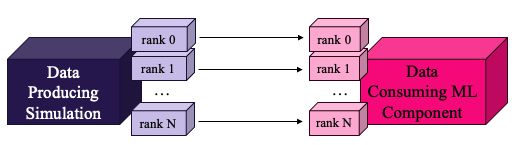
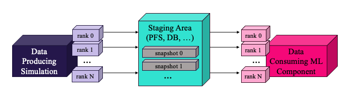

# Data Streaming/Staging Benchmark for Producer-Consumer Workflows

This benchmark measures the data streaming and staging performance of a simple
producer-consumer workflow pattern, in which a mock simulation produces data
that is consumed by a mock ML component. The benchmark is implemented on top of
several workflow libraries so their end-to-end data-movement performance can be
compared on a common workload.

The workflow consists of two components running concurrently:

- A **data-producer** (mock simulation) that generates data on each
  MPI rank at every iteration.
- A **data-consumer** (mock ML script) that receives the data
  from the producer and consumes it.

Data can either be streamed directly from producer ranks to consumer ranks, or
staged through an intermediate storage/service and then pulled by the consumer.

A diagram for the streaming implementation is shown below.

  

A diagram for the staging implementation is shown below.

  

## Configurable Parameters

The benchmark has two main configuration options:

- **Deployment strategy**: producer and consumer can be *colocated* to share compute resources on the same
  nodes or *clustered* on distinct sets of nodes. In the colocated deployment, data can be streamed/staged within each node eliminating the need for inter-node transfers. In the clustered deployment, data is forced to move across the network from producer to consumer.
- **Data size**: the size of the per-rank message exchanged each iteration can
  be varied to sweep from small messages to large transfers.

## Implementations

The same benchmark is implemented on top of several workflow libraries and a
plain MPI baseline for reference.

| Implementation | Transport / Mechanism | Notes |
|----------------|-----------------------|-------|
| [`mpi`](./mpi) | MPI point-to-point `send`/`recv` | Baseline; considered peak achievable performance for workflow tools. |
| [`adios2`](./adios2) | SST streaming (WAN, RDMA); BP5 file I/O to PFS, or DAOS POSIX container | Same code path with different ADIOS2 engines/back-ends. |
| [`smartsim`](./smartsim) | Staging through a Redis in-memory database with inter-node TCP transfer | Uses SmartSim to orchestrate and SmartRedis clients to move data. |
| [`dragonhpc`](./dragonhpc) | Streaming through `multiprocessing.Queue`; staging through the Dragon Distributed Dictionary (DDict); both over RDMA | Two data-movement modes exposed by the DragonHPC runtime. |

See each subdirectory's scripts for build, environment, and job-submission
details.

**Note:** The current implementation of the benchmarks is designed to run on CPUs only. A GPU-enabled versoin of the benchmark to test GPU-direct data transfer will be provided soon.
