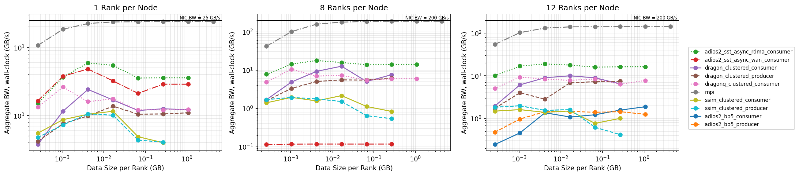
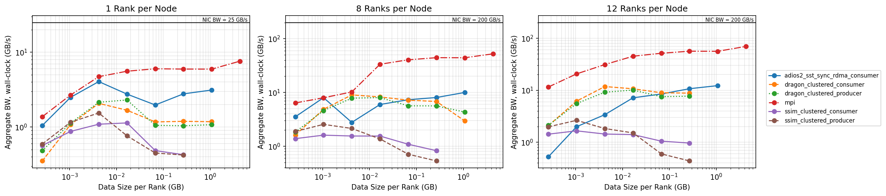
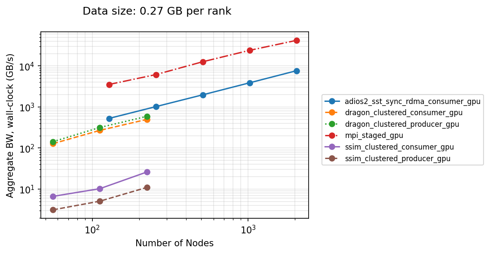

# Data Streaming/Staging Benchmark for Producer-Consumer Workflows

This benchmark measures the data streaming and staging performance of a simple
producer-consumer workflow pattern, in which a mock simulation produces data
that is consumed by a mock ML component. The benchmark is implemented on top of
several workflow libraries so their end-to-end data-movement performance can be
compared on a common workload.

The workflow consists of two components running concurrently:

- A **data-producer** (mock simulation) that generates data on each
  MPI rank at every iteration.
- A **data-consumer** (mock ML script) that receives the data
  from the producer and consumes it.

Data can either be streamed directly from producer ranks to consumer ranks, or
staged through an intermediate storage/service and then pulled by the consumer.

A diagram for the streaming implementation is shown below.

  

A diagram for the staging implementation is shown below.

  

## Configurable Parameters

The benchmark has three main configuration options:

- **Deployment strategy**: Producer and consumer can be *colocated* to share compute resources on the same
  nodes or *clustered* on distinct sets of nodes. In the colocated deployment, data can be streamed/staged within each node eliminating the need for inter-node transfers. In the clustered deployment, data is forced to move across the network from producer to consumer.
- **Data size**: The size of the per-rank message exchanged each iteration can
  be varied to sweep from small messages to large transfers.
- **Producer buffer location**: The producer's data buffer can live on the CPU or on the GPU (SYCL USM device memory), selectable via a `device` argument that defaults to `gpu`. The consumer buffer always lives on the CPU (mock ML reads typically keep training data on the host and only stage each batch to the GPU).
  - For the `mpi` case, both producer and consumer buffers live on the same device — GPU→GPU transfers rely on GPU-aware MPI.
  - For the `adios2` case, the producer passes the SYCL USM device pointer directly to `Put`, with `Variable::SetMemorySpace(MemorySpace::GPU)` set so ADIOS2 knows the buffer is on the device. 
  - For the `smartsim` and `dragonhpc_ddict` cases, the producer explicitly stages its GPU buffer down to a host buffer before handing it to the workflow tool (SmartRedis and DDict put paths are host-only). This D→H copy is included in the reported per-put time so the measurement reflects the true cost of transfering GPU-resident data through each tool.

## Implementations

The same benchmark is implemented on top of several workflow libraries and a
plain MPI baseline for reference.

| Implementation | Transport / Mechanism | Notes |
|----------------|-----------------------|-------|
| [`mpi`](./mpi) | MPI point-to-point `send`/`recv` | Baseline; considered peak achievable performance for workflow tools. |
| [`adios2`](./adios2) | SST streaming (WAN, RDMA); BP5 file I/O to PFS, or DAOS POSIX container | Same code path with different ADIOS2 engines/back-ends. |
| [`smartsim`](./smartsim) | Staging through a Redis in-memory database with inter-node TCP transfer | Uses SmartSim to orchestrate and SmartRedis clients to move data. |
| [`dragonhpc_ddict`](./dragonhpc_ddict) | Staging through the Dragon Distributed Dictionary (DDict) over RDMA | C++/Python workflow orchestrated with `dragon` using C++/Python DDict clients. |
| [`dragonhpc_queue`](./dragonhpc_queue) | Streaming through `multiprocessing.Queue` over RDMA | Python workflow orchestrated with `dragon` and using one queue for each producer-consumer pair of ranks. |

See each subdirectory's scripts for build, environment, and job-submission
details.

## Results

### Minimal Clustered Runs on ALCF Aurora

The following results show the performance of the workflow tools in their minimal configuration for a clustered run. For streaming and staging through the parallel file system, this means 2 nodes, for in-memory staging, this means 3 nodes where one node is dedicated to the staging component (e.g., Redis DB or Dragon DDict).

Using CPU buffers in the producer.

  

Using GPU buffers in the producer.

  

<!-- Generated with python plot_bw.py --nodes 2 --metric aggregate_wall --nic-bw 25,200,200 --ranks-per-node 1,8,12 -->

Results obtained on 09/01/2026 using ADIOS2 2.11.0, SmartSim/SmartRedis `develop` branches, DragonHPC 0.14.0.

### Scaling Clustered Runs on ALCF Aurora

The following results show the performance of the workflow tools in their clustered configuration as the number of nodes are scaled up. The experiments are weak-scaling tests, where the buffer size per rank is kept constant but the number of ranks (12 per node) increases linearly. For the SmartSim and DragonHPC+DDict implementations using in-memory staging, the number of nodes assigned to data staging is also increased linearly with the number of nodes (starting with 8 staging nodes and 56 nodes split equally between producer and consumer). GPU buffers were used for the producer.

  

<!-- Generated with python plot_bw.py --nodes 56,112,124,128,224,248,256,512,1024,2048 --impl mpi,adios2_sst_sync_rdma_consumer,ssim_clustered_consumer,ssim_clustered_producer,dragon_clustered_consumer,dragon_clustered_producer --metric aggregate_wall --device gpu,staged_gpu --ranks-per-node 12 --data-size 268435456 -->

Results obtained on 09/01/2026 using ADIOS2 2.11.0, SmartSim/SmartRedis `develop` branches, DragonHPC 0.14.0.

